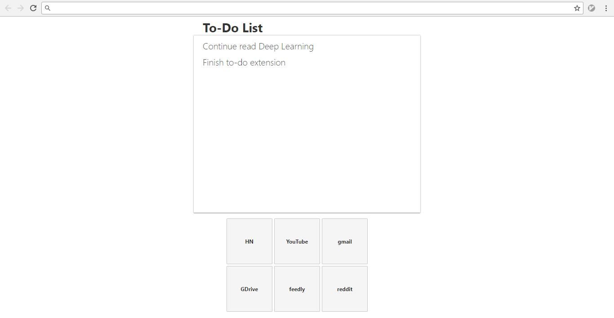

# Super Simple Chrome New Tab To-Do List Extension

I created this extension because I haven't found anything like this on the store, yet I really need it. Currently the javascript is only used for storing values of the to-do list. The websites at the bottom can only be changed through `index.html`.

At my browser the extension looks like this (`index.html` will look different if you just open it right away, although I still don't understand why):

To have this as a Chrome extension, you need to clone this repo, [then](https://superuser.com/questions/907234/change-chrome-new-tab-page-to-local-file)

1. Open `chrome://extensions` and click the `Developer mode` checkbox on the top right.
2. Click the `Load unpacked extension...` button
3. Navigate to the folder and click select

TODO:

- Set up `font-family` on `style.css`
- Polish the extension and publish to the store